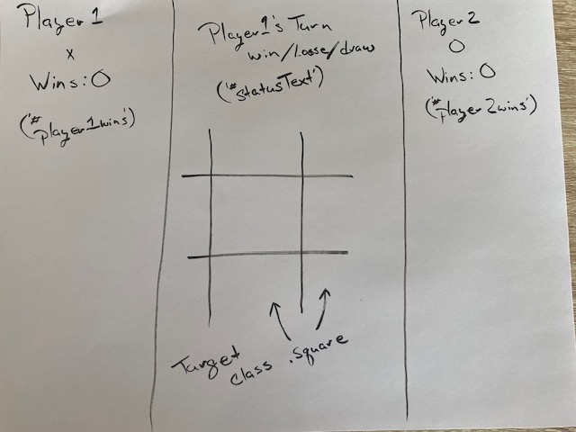

# Tic-Tac-Toe

### Abstract:
This project is an interactive 2 player tic-tac-toe game.  The interface allows the user to place tokens in empty spaces on the game board. The data model keeps track of the token placement and wins of each player.  The DOM displays wins for each player, current players turn and the outcome of the game Win/Loose/Draw.  The game board is reset at the conclusion of the game.  

---
### Installation Instructions:
The user can visit this web site: 
https://github.com/butlertree/tictac

Fork this repo and copy the SSH.  Clone the repo down to your local machine.  git clone (SSH copy), cd into the folder.  

---
### Preview of App:

---
### Context:
We worked on this project as our Mod 1 Group Assignment and had one week to work on it. As of the submission of the project we will have completed Week 4 of Mod 1 of the Front End Engineering program at Turing School of Software and Design.

---
### Contributors:
#### Dev Team:

- [Chris Butler](https://github.com/butlertree)
#### Project Manager:

---
### Learning Goals:
- Gain an understanding of how to write clean HTML and CSS to match a provided comp
- Understand how a developer might separate the data model from the DOM model
- Incorporate & iterate over arrays in order to filter what is being displayed
- Craft code with clean style, using small functions that show trends toward DRYness, SRP, and purity
---
### Wins + Challenges:

- Wins
  - We were able to complete all required iterations (0-4) with no known bugs remaining.  
  - We also added a couple of small enhancements.
  - We were able to set up a GitHub Project and organize the work using tickets so that we all knew what each of us was working on at any given time.  This also allowed us to more easily to keep track of completed and remaining work.   
  - We maintained strong communication throughout the project.  
- Challenges
  - Initially we experienced challenges around merge conflicts.
    - After unsuccessfully troubleshooting as a team we reached out to our instructors for guidance. Travis was able to point us in the correct direction. We then worked through subsequent merge conflicts together  